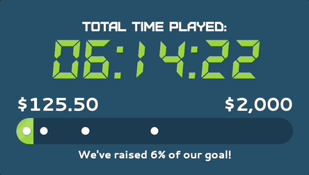

# Extra Life Helper



## About

The Extra Life Helper is a web application that Extra Life participants and teams can use to support their fundraising efforts. It was designed to be used in the following ways:

* Added to an OBS scene as a browser source for inclusion in a LIVE stream on Twitch, YouTube, or TikTok

* Embedded in any website via an `iframe`
* Displayed fullscreen on a large monitor or projector for a local in-person event

<br>

## Features

The Helper has been developed and maintained for over a decade. It has a lot of features to help Extra Life participants and teams with their success!

* Works in "participant" mode or "team" mode

* Counts down the days until an Extra Life event if there are three or more days left
* Counts down the hours until an Extra Life event if there are less than four days left
* Counts the total hours played if the start time has passed
* Continually updates the total amount raised as it changes
* Provides multiple ways to display progress:
  - Amount raised only
  - Amound raised and goal
  - Progress bar with optional milestone markers
* Shows fun and exciting real-time alerts as donations are received
* Shows celebatory alerts when milestones have been reached
* Provides the option for donation messages to be read with text-to-speech
* Provides volume control for all sound effects and text-to-speech
* Occasionally shows the Extra Life logo
* Ocassionally shows the last five donations that were made to recognize recent supporters
* Provides four color theme choices that are Extra Life branded and also provides the ability to design a compltely custom color theme
* Works in any flavor of OBS and any modern browser
* Looks sharp at any 16:9 or 16:10 aspect ratio size including full screen
* Fully localized in English, French, and Spanish
* Architected so other developers can fork and make changes for themselves or their Extra Life teams

<br>

## For Extra Life Participants

If you are simply here to use the Helper, please visit the Helper website! It provides a quick and easy way to customize the Helper and generate a link you can use for your LIVE stream or website.

[https://breadweb.net/extralife-helper](https://breadweb.net/extralife-helper)

<br>

## For Developers

The Extra Life Helper is written in JavaScript and React. [Tailwind](https://tailwindcss.com/) is used for CSS and [Vite](https://vitejs.dev/) is the framework for local development and making builds.

If you've been wanting to develop your own React application that works with the Extra Life API, there are pleny of reusable components and hooks that you can leverage. Also included are some Python scripts that enable rapid local testing against a mock version of the Extra Life API.

If you are interested in modifying the Helper to meet specific requirements for yourself or your Extra Life team, please review the following sections.

### Runtime Modes

The Helper runs in one of three different ways:

1. `DEV` - This is used when developing the Helper with the Vite development server. Changes you make can be previewed instantly.

2. `LOCAL` - This is a compiled version of the Helper that is condensed into a single HTML file. This file can be run in a browser from the file system. It is ideal for personal use of your modified Helper or distribution to a team when you don't have a hosting solution.

3. `REMOTE` is used when building the Helper as a collection of files for deployment to a hosting solution such as AWS S3. This is what is used for the [official remote version](https://breadweb.net/extralife-helper/) of the Helper but can be used to deploy your modified Helper to your own server.

### Development Setup

```shell
cd helper
cp .env.local.example .env.local
npm install
npm run dev
```

The Helper will now be running via the Vite development server at [http://localhost:5173](http://localhost:5173).

### Configuration

There is a config file per mode. These files contain a combination of **application** settings and **user** settings.

* `DEV` mode: `.env.local`
* `LOCAL` mode: `.env.deploy.LOCAL`
* `REMOTE` mode: `.env.deploy.REMOTE`

### User Settings

The Helper is able to be used by anyone by changing the settings. Users will need to provide their participant ID or team ID so the Helper can get their information from the Extra Life API. The remaining user settings affect how the Helper looks and functions.

User settings are parsed differently based on what mode the Helper is running in.

* `DEV` mode: User settings are read from the environment variables defined in the `.env.local` config file.

* `LOCAL` mode: User settings are read from the compiled single HTML file. The initial values are provided by the `.env.deploy.LOCAL` config file at build time, but users can edit the values in the compiled HTML file so it works for them.

* `REMOTE` mode: User settings are read from the querystring.

### Application Settings

The application settings are highly tuned and not able to be changed by users. The most common use case is developers changing them to support rapid development and testing.

> [!CAUTION]
> Do not change the `VITE_POLLING_INTERVAL` application setting to a value below `15000` if you are targeting the Extra Life API via the `VITE_API_BASE_URL` value. A smaller value will almost certainly result in you getting rate limited by the Extra Life API.

### Mock API

When developing locally, it is highly reccomended to use the mock API. This will prevent you from accidentally spamming the real Extra Life API and getting rate limited. You will also be able to test different flows by simulating donations.

The `mock-api` directory contains mock responses for participant and team endpoints currently used by the Helper. Simply run the following command and the mock API will be running `http://localhost:5174`.

```shell
python tools/webserver.py mock-api -p 5174
```

Then, update the `VITE_API_BASE_URL` config entry in the `.env.local` file to this URL value.

The included `tools/mock.py` Python script provides a number of commands to update the mock API quickly and in the same way the Extra Life API operates. View the help to see the options.

```shell
python tools/mock.py -h
```

### Building

To build for `LOCAL` mode:

```shell
cd helper
npm run build:LOCAL
```

The output will be a single `index.html` file in the `helper/dist` directory. The Helper can be run by dragging the file from the file system into a browser.

To build for `REMOTE` mode:

```shell
cd helper
npm run build:REMOTE
```

The output will be a collection of files in the `helper/dist` which are intended to be deployed to a hosting solution.

### Deployment

Deployment instructions are out of scope for this documentation. If you are considering deploying your modified Helper to your own hosting solution, it is assumed you are familiar with the requirements for deploying a React web application.

### Contributing Back

If you have fixed a bug or have a suggested feature change that would benefit all users of the Helper, please make a pull request and I will be happy to review it.

Before creating the PR, please ensure the following:

* You have run `npm run lint` in the `helper` directory and have corrected all warnings and errors.
* You have reverted any changes made strictly to support your personal testing and not required for the fix or feature. This includes changes in the tracked `.env.deploy.*` files and `mock-api` files.

<br>

## License

Distributed under the MIT license. See [LICENSE](https://github.com/breadweb/extralife-helper/blob/main/LICENSE.txt) for details.

<br>

## History

I originally created the Helper in 2013. There were no tools available at the time for tracking the time until Extra Life, tracking total time played on game day, **and** showing fundraising progress. I also wanted to celebrate new donations in real time with my audience while streaming during the marathon. The following year I made it available to the community and it has been used by many Extra Life participants since.

* **2013**: Built with Actionscript as a Flash application which scraped Extra Life website pages for information.

* **2014**: Added personalization and shared with the Extra Life community. Added an executable wrapper for caputre in OBS.
* **2015**: Updated to work with the new Extra Life API.
* **2016**: Added a suite of new configuration options including color themes and borders.
* **2017**: Refactored as a basic web application written in JavaScript. Added more donation alert features.
* **2018**: Added displaying of donation messages and text-to-speech reading of them.
* **2019**: Added a remote version of the Helper that no longer required downloading and modifying files. Added localization in Spanish and French.
* **2020 - 2023**: Fixed bugs, updated to use latest Extra Life API, and updated to the latest Extra Life branding.
* **2024**: Refactored to use modern JavaScript frameworks and web app development practices. Added milestone alerts, a latest donations view, progress bar with milestone markers, transparent background support, complete color theme customization, and more.

<br>

## Credits

Translations were provided with help from the following awesome people:

* French: Max Delisle, Craig Segal, Theo Vaillant
* Spanish: Juliet Veulens, Jesus Lio

<br>

## Donations

It's been really rewarding to see the Helper being used by so many people who are supporting great cause. I do not expect anything in return, but if you are determined, you could always make a donation to my [Extra Life](https://bread4kids.tv/extralife) since this is all for the kids!

<br>

## Support and Contact

Please [report issues](https://github.com/breadweb/extralife-helper/issues) here on GitHub. For additional support, you can join my [Discord server](https://bread4kids.tv/discord) and send me a DM.

I'd also love to see the Helper being used on your stream! Let me know about your channel so I can watch and cheer you on. Good luck with your fundraising for Extra Life!

Adam "Bread" Slesinger

* Twitch: [https://bread4kids.tv](https://bread4kids.tv)
* Extra Life: [https://bread4kids.tv/extralife](https://bread4kids.tv/extralife)
* Discord: [https://bread4kids.tv/discord](https://bread4kids.tv/discord)
* YouTube: [https://youtube.com/breadweb](https://youtube.com/breadweb)
